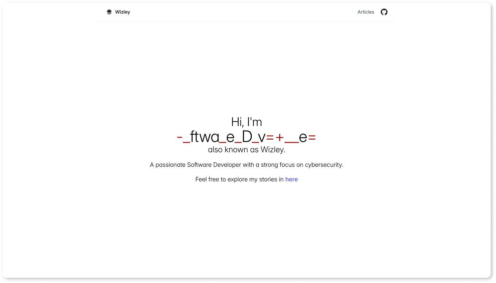
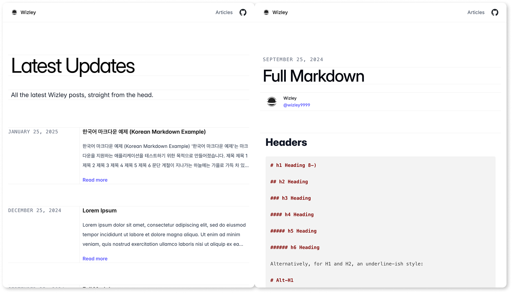

# Wizora

This project is a simple static site generator designed to convert Markdown-based posts into static HTML pages. It reads content from a directory, processes the data, and generates a fully static website with an index page, individual post pages, and a sitemap.

## Overview

Live: [blog.wizley.io](https://blog.wizley.io/)




## Features

- **Markdown to HTML Conversion**: The site generator reads `.md` files from the `contents` directory and converts them into static HTML pages.
- **Template Rendering**: Uses HTML templates for consistent layout across pages. Templates include a `header`, `footer`, and `layout` among others.
- **Post Previews**: On the index page, posts are displayed with a title, date, and a preview of the content.
- **Post Detail Pages**: Each post has a dedicated page with full content.
- **Sitemap Generation**: Generates a sitemap for search engine indexing.
- **Customizable Configuration**: Site information like name, GitHub URL, and Giscus integration can be customized via a `config.yaml` file.

## Project Structure

```bash
├── contents/                # Directory for blog posts (Markdown files)
│   ├── [post-slug]/[image].png
│   └── [post-slug]/index.md
├── public/                 # Generated static site files (HTML, assets)
├── templates/              # HTML templates for rendering pages
│   ├── base.html
│   ├── header.html
│   ├── footer.html
│   ├── ...
│   └── ...
├── config.yaml             # Configuration file for site settings
├── build.js                # Main script for generating the site
└── package.json            # Node.js dependencies and scripts
```

## Configuration

The `config.yaml` file allows you to customize various aspects of the site, such as:

`base`: The base URL for your site.
`name`: The name of your blog or site.
`github`: The GitHub username.
`giscus`: Configuration for embedding Giscus comments in posts (requires setting up Giscus).

### Example of `config.yaml`

```yaml
base: "https://myblog.com"

author:
  name: "My Blog"
  github: "github-username"
  identities:
    - "Word1"
    - "Word2"
    - "Word3"
  tagline: "A short-sentence self-introduction"

giscus:
  repo: "username/repository"
  repoId: "repository-id"
  category: "General"
  categoryId: "category-id"
  mapping: "pathname"
  reactionsEnabled: "1"
  inputPosition: "top"
  theme: "light"
  lang: "en"
```

## How to Use

### 1. Install Dependencies

Before running the static site generator, install the necessary dependencies:

```bash
npm install
```

### 2. Prepare Your Content

Place your blog posts in the `contents/` directory. Each post should be a directory named after its slug, containing an `index.md` file with front-matter metadata and the content in Markdown format.

#### Example of contents/first-post/index.md

```markdown
---
title: "My First Post"
date: "2025-03-19"
---

This is the content of my first post. It's written in Markdown.
```

### 3. Customize the Templates

Edit the HTML files in the `templates/` directory to fit your design needs. The templates are:

- `base.html`: The main layout for the pages (includes header, footer, and content).
- `header.html`: The header section of the site (can include site name, navigation, etc.).
- `footer.html`: The footer section of the site (can include copyright, social links, etc.).
- `post-list.html`: Template for displaying a list of posts.
- `post-item.html`: Template for individual post previews on the index page.
- `post-detail.html`: Template for individual post pages.

### 4. Run the Generator

Once your content and templates are ready, run the site generator.

```bash
npm run build
```

This will:

1. Generate `styles/output.css` through the @tailwindcss/cli based on `templates/input.css`.
2. Read all the `.md` files in the `contents/` directory.
3. Generate static HTML files for each post in the `public/` directory.
4. Create an `index.html` file listing all the posts.
5. Copy over any non-Markdown assets like images into the `public/` directory.
6. Generate a `sitemap.xml` for search engine indexing.

### 5. Others

You can view the site live locally by running `npm run dev`.

## License

MIT Licensed, see [LICENSE](https://github.com/wizley9999/wizora/blob/main/LICENSE).
